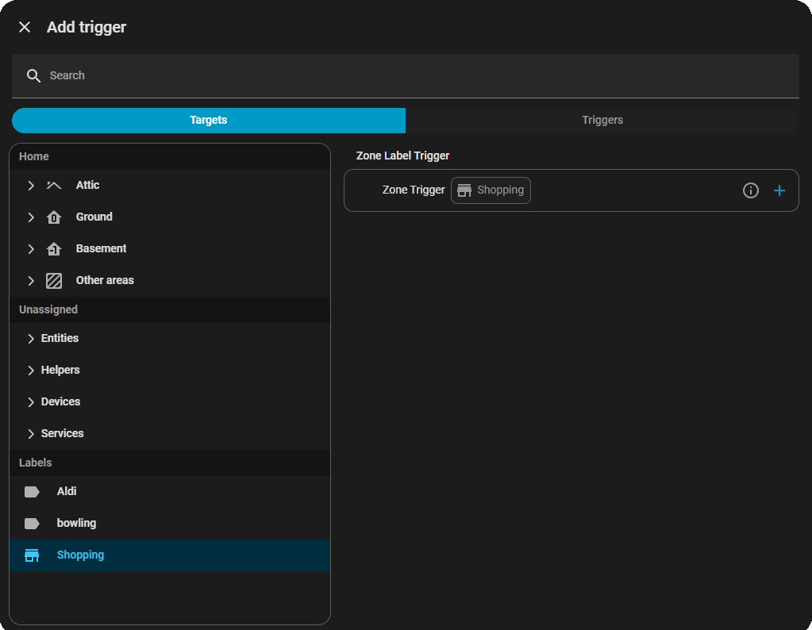
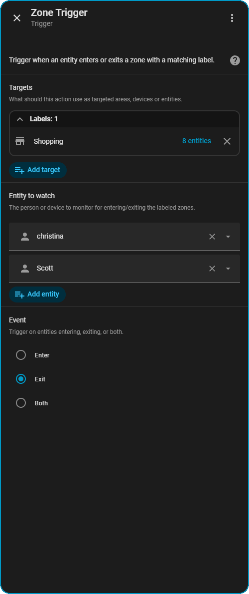

<br/>
<br/>
<br/>
[](https://github.com/mutilator/homeassistant-zone-label-trigger/releases)


# Zone Label Trigger

This repository contains a **custom Home Assistant integration** named **Zone Label Trigger**.  It provides a new automation trigger platform called `zone_label` which lets you watch people or device trackers as they enter or exit zones that share a common label.  Labels are managed by Home Assistant's entity/zone registries and make it easy to group arbitrary zones (work, home, school, etc.) without hard‑coding entity IDs.

## Features

- **New automation trigger**: `platform: zone_label`
- Filter zones by a **label** applied in the entity registry (case‑insensitive)
- Optional explicit list of zone entity IDs instead of labels
- Monitored entities can be one or more `person` or `device_tracker` entities (you may supply a single item or a list)
- Trigger when a monitored entity **enters**, **exits**, or **both**
- Works with both legacy trigger config and the newer **Trigger class API**
- Fully integrated with the **Automation Editor** (label selector + event dropdown)
- Returns rich trigger data: entity, zone, from_state, to_state, and event
- Conservative membership matching: compares entity state to zone id, object id, and friendly name (case‑insensitive)
- Includes extensive unit tests exercising configuration schema and helper logic
- **Developer helper service**: `zone_label_trigger.move_tracker_to_zone` can move a demo device_tracker into any zone for testing purposes

# Labs integration preview



# Configuration preview




## Tests

In addition to the trigger behaviour, the integration exposes a simple
helper service (`zone_label_trigger.move_tracker_to_zone`) which is registered
during setup when the integration is loaded.  It is primarily intended for
unit/integration tests and local development; see the `__init__.py` docstring
for details.

The repository also includes example test cases in `tests/` demonstrating how the trigger is used in automations.

### Basic trigger example

```yaml
trigger:
  - platform: zone_label
    target:
      label_id: "Work"        # or list of labels
    options:
      entity_id: person.alice   # or a list of entities (e.g. `[person.alice, person.bob]`)
      event: enter

action:
  service: notify.notify
  data:
    message: "Alice arrived at a work location"
```

### Explicit zones instead of labels

```yaml
trigger:
  - platform: zone_label
    target:
      entity_id: [zone.office, zone.warehouse]
    options:
      entity_id: [device_tracker.rucksack, person.bob]   # you can watch multiple entities
      event: both
```
> **Note:** for class-style triggers (UI) the `target` block is separate from the
> `options` block, but the behaviour is identical.  See `tests/test_zone_label_trigger.py` for examples.

## Installation

### Via HACS (Recommended)

1. Open HACS in Home Assistant
2. Click "Custom repositories" in the top right
3. Add this repository:
   - **Repository URL**: `https://github.com/mutilator/homeassistant-zone-label-trigger`
   - **Category**: Integration
4. Click "Install"
5. In Home Assistant, go to **Settings > Devices & Services**
6. Click **Create Automation** and search for "Zone Label" or look for the trigger named **Zone Label Trigger**
7. Follow the setup wizard

### Manual installation

1. Download or clone this repository.
2. Copy the `custom_components/zone_label_trigger` directory into your
   Home Assistant `custom_components/` folder:
   ```
   cp -r homeassistant-zone-label-trigger/custom_components/zone_label_trigger \
     ~/.homeassistant/custom_components/
   ```
3. Restart Home Assistant.
4. Create automations using the `zone_label` trigger in the UI or YAML.

## Development

The integration has a fairly small codebase and a focused unit test suite.
Follow the general Home Assistant custom component development workflow:

1. Activate the Python virtual environment used for testing:
   ```bash
   source venv/bin/activate
   ```
2. Install any dependencies (none required beyond `homeassistant` itself).
  ```bash
   python3 -m pip install homeassistant
   ```
3. Run the tests:
   ```bash
   python3 -m pytest tests/ -v
   # or run only the trigger tests
   python3 -m pytest tests/test_zone_label_trigger.py -k zone_label -v
   ```

> **Testing tip:** give pytest a timeout of at least 120 seconds; the HA test
> fixtures take a moment to initialize.

## Repository Layout

```
/
├── custom_components/zone_label_trigger/  # integration implementation
│   ├── __init__.py
│   ├── trigger.py                # core trigger logic
│   ├── config_flow.py            # (unused helper example)
│   ├── manifest.json
│   ├── triggers.yaml             # UI editor schema
│   └── translations/en.json      # strings for editor
└── tests/                          # unit tests
    ├── test_zone_label_trigger.py
    ├── test_zone_label_trigger_hass.py
    ├── test_config_flow_zone_label.py
    └── test_zone_label_imports.py
```

---

**Get started** by creating a `zone_label` trigger in your next automation!
