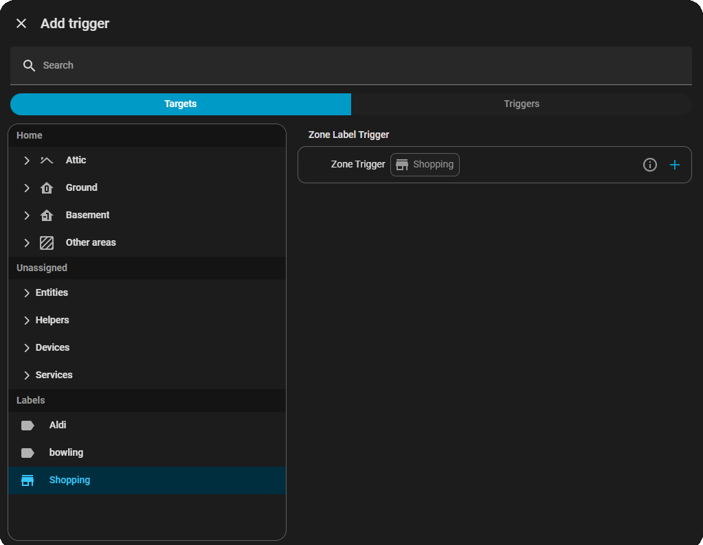
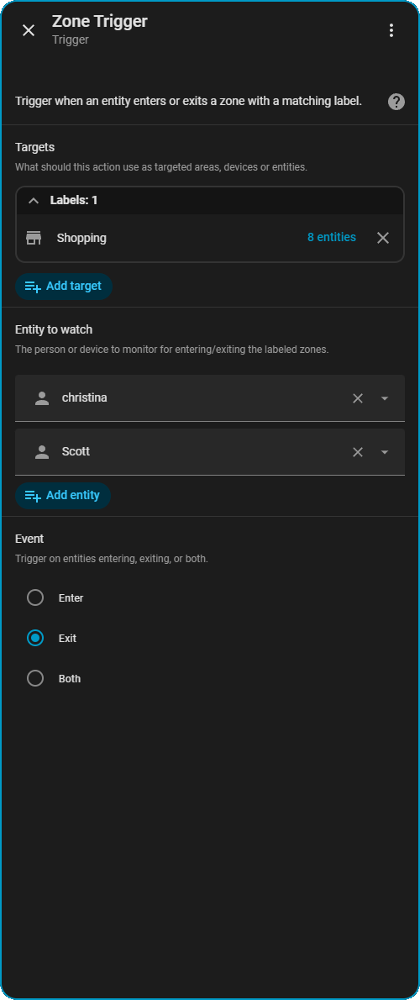

# Zone Label Trigger

[](https://github.com/mutilator/homeassistant-zone-label-trigger/releases)

A **custom Home Assistant integration** that adds an automation trigger, `zone_label_trigger.zone_label`. It fires when a person or device tracker enters or exits any zone that carries a given **label**.

Labels let you group zones (work sites, stores, family homes, etc.) and write one automation for the whole group, without listing every zone entity ID.

## Features

- New automation trigger: `zone_label_trigger.zone_label`
- Select zones by one or more **labels** (`target.label_id`), by explicit zone entity IDs (`target.entity_id`), or both
- Watch one or more `person` or `device_tracker` entities
- Fire on **enter**, **exit**, or **both**
- Works in the **Automation Editor** (zone/label target picker, entity picker, event dropdown) and in YAML
- Label membership is re-checked on every state change, so zones you label later are picked up without reloading the automation
- Rich trigger data: `entity_id`, `zone`, `event`, `from_state`, `to_state`
- Developer helper service, `zone_label_trigger.move_tracker_to_zone`, for testing

## Requirements

- Home Assistant **2025.12** or newer
- To use the trigger in the Automation Editor, turn on the **New triggers and conditions** preview feature under **Settings → System → Labs**. YAML automations work without it.



## Installation

### Via HACS (recommended)

1. Open HACS in Home Assistant.
2. Open the menu in the top right and choose **Custom repositories**.
3. Add `https://github.com/mutilator/homeassistant-zone-label-trigger` with the category **Integration**.
4. Find **Zone Label Trigger** in HACS and click **Download**.
5. Restart Home Assistant.
6. Go to **Settings → Devices & services → Add integration**, search for **Zone Label Trigger**, and add it. There is nothing to configure.

### Manual installation

1. Download or clone this repository.
2. Copy `custom_components/zone_label_trigger` into your Home Assistant `custom_components/` folder:
   ```bash
   cp -r homeassistant-zone-label-trigger/custom_components/zone_label_trigger \
     /config/custom_components/
   ```
3. Restart Home Assistant.
4. Go to **Settings → Devices & services → Add integration** and add **Zone Label Trigger**.

## Usage

### 1. Label your zones

Go to **Settings → Areas, labels & zones → Zones** and add the same label to each zone you want to group, for example `Work`.

The trigger matches on the **label ID**, not the display name. A label created as `Work` gets the ID `work`. The Automation Editor fills in the ID for you; in YAML, use the ID.

### 2. Create an automation

In the Automation Editor, add a trigger and search for **Zone Trigger**. Pick the label (or zones) as the target, choose who to watch, and choose the event.



### YAML examples

Notify when Alice arrives at any zone labeled `work`:

```yaml
triggers:
  - trigger: zone_label_trigger.zone_label
    target:
      label_id: work            # or a list: [work, client_sites]
    options:
      entity_id: person.alice   # or a list: [person.alice, person.bob]
      event: enter
actions:
  - action: notify.notify
    data:
      message: "{{ trigger.entity_id }} arrived at {{ trigger.zone }}"
```

Use explicit zones instead of labels, and fire on both enter and exit:

```yaml
triggers:
  - trigger: zone_label_trigger.zone_label
    target:
      entity_id: [zone.office, zone.warehouse]
    options:
      entity_id: [device_tracker.rucksack, person.bob]
      event: both
```

`label_id` and `entity_id` can be combined in the same `target`.

### Options

| Key | Required | Description |
| --- | --- | --- |
| `target.label_id` | One of these two | Label ID, or list of IDs. Every zone with that label is matched. |
| `target.entity_id` | One of these two | Zone entity ID, or list of IDs. |
| `options.entity_id` | Yes | `person` or `device_tracker` entity, or a list of them, to watch. |
| `options.event` | Yes | `enter`, `exit`, or `both`. |

### Trigger data

These variables are available in templates in your actions:

| Variable | Description |
| --- | --- |
| `trigger.event` | `enter` or `exit` |
| `trigger.entity_id` | The person or device tracker that moved |
| `trigger.zone` | The matched zone's entity ID |
| `trigger.from_state` | The entity's previous state object |
| `trigger.to_state` | The entity's new state object |

### How zone membership is decided

An entity counts as "in" a zone when its state matches the zone's entity ID (`zone.office`), object ID (`office`), or friendly name (`Office`). The comparison ignores case. A `person` or `device_tracker` at home has the state `home`, which matches `zone.home`.

## Helper service

`zone_label_trigger.move_tracker_to_zone` sets a `device_tracker` entity's state and GPS attributes to match a zone. It is meant for testing automations and local development.

```yaml
action: zone_label_trigger.move_tracker_to_zone
data:
  zone: zone.office
  entity_id: device_tracker.demo_paulus
```

## Development

1. Create and activate a virtual environment:
   ```bash
   python3 -m venv venv
   source venv/bin/activate
   ```
2. Install the test dependencies:
   ```bash
   python3 -m pip install -r requirements.txt
   ```
3. Run the tests:
   ```bash
   python3 -m pytest tests/ -v
   # or only the trigger tests
   python3 -m pytest tests/test_zone_label_trigger.py -v
   ```

> **Testing tip:** allow pytest at least 120 seconds. The Home Assistant test fixtures take a while to start.

### Repository layout

```
/
├── custom_components/zone_label_trigger/  # the integration
│   ├── __init__.py               # setup and helper service
│   ├── trigger.py                # trigger logic
│   ├── config_flow.py            # single-entry config flow (no options)
│   ├── manifest.json
│   ├── triggers.yaml             # Automation Editor schema
│   ├── services.yaml             # helper service schema
│   ├── translations/en.json      # editor strings
│   └── brand/icon.png
├── tests/
│   ├── test_zone_label_trigger.py
│   ├── test_zone_label_trigger_hass.py
│   ├── test_config_flow_zone_label.py
│   └── test_zone_label_imports.py
├── img/                          # README screenshots
└── hacs.json
```
